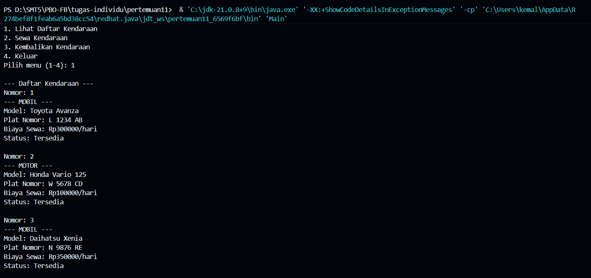
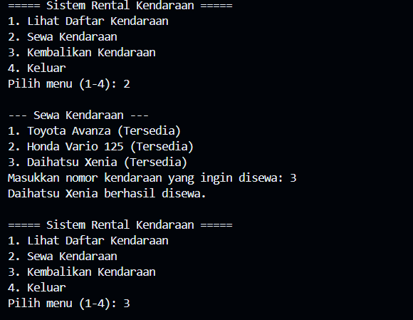
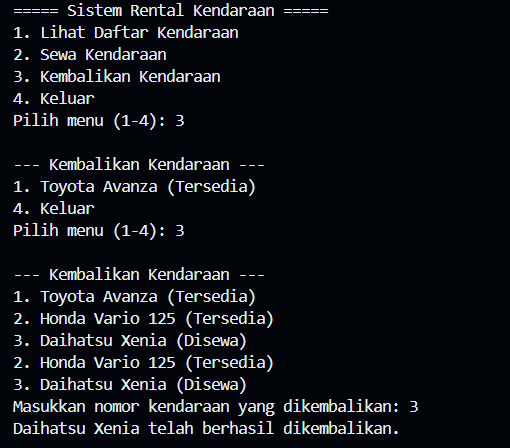

# Tugas 11 - Pemrograman Berorientasi Objek B

## Task

Implementasi class inheritance

## Implementasi

### Logika Naif

Client dapat memilih beberapa opsi yaitu:
    1. Menampilkan list kendaraan yang tersedia
    2. Menyewa kendaraan
    3. Mengembalikan kendaraan yang disewa
    4. Keluar dari program

### Struktur Class

- Main.java
- Kendaraan.java (superclass)
- Mobil.java (kelas turunan kendaraan untuk mobil)
- Motor.java (kelas turunan kendaraan untuk motor)

### Dokumentasi

- Tampilan program ketika dijalankan

    - Case 1 : Menampilkan list kendaraan
    

    - Case 2 : Menyewa kendaraan  
    

    - Case 3 : Mengembalikan kendaraan
    

