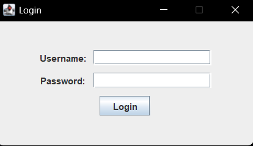
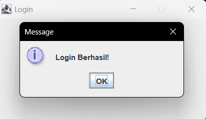
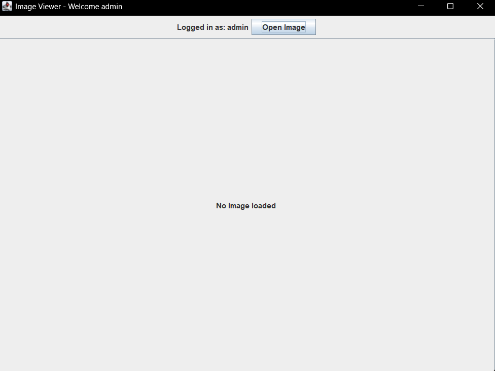
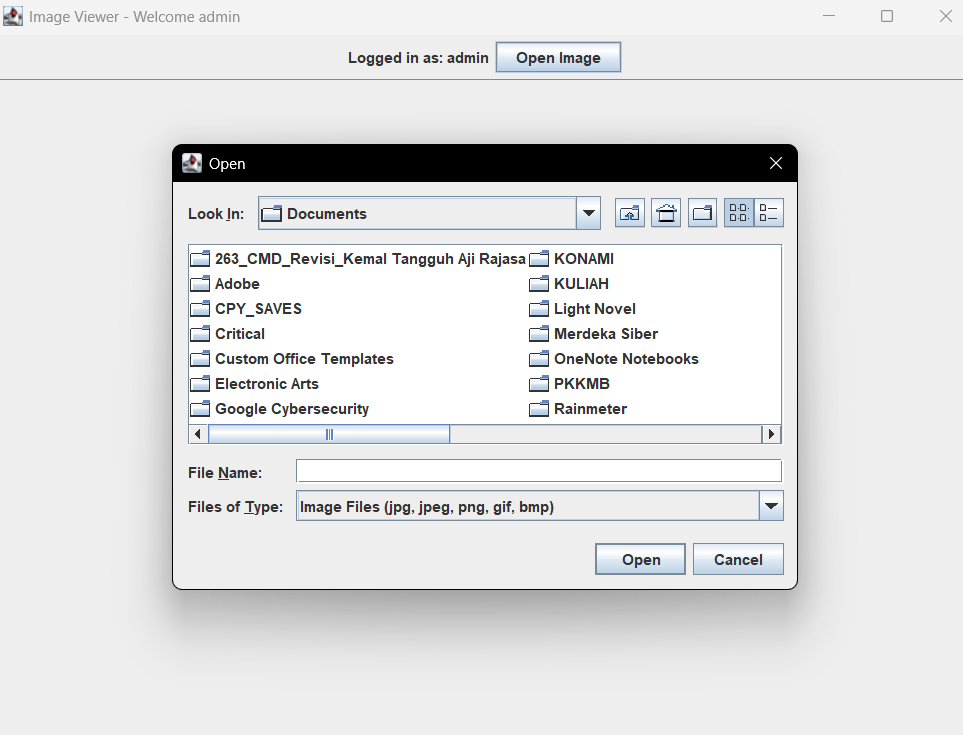

# Tugas 13 - Pemrograman Berorientasi Objek B

## Task
Membuat sebuah implementasi GUI

## Implementasi

### Logika Naif

GUI digunakan untuk menjembatani user dengan program, pada program implementasi sederhana ini adalah sebuah interface untuk login.
		
### Struktur Class
- AuthController.java
- ImageViewerFrame.java
- LoginFrame.java
- User.java

### Dokumentasi
- Tampilan aplikasi

