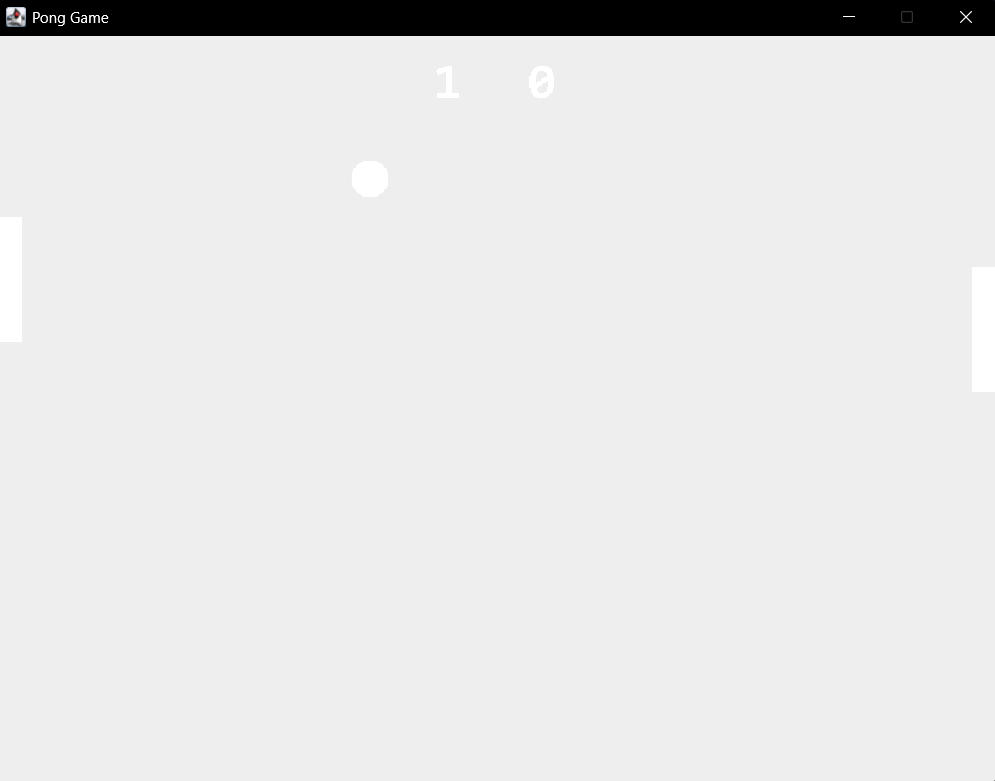

# Tugas 14 - Pemrograman Berorientasi Objek B

## Task
Implementasi Pong Game

## Implementasi

### Logika Naif

Pong game adalah game klasik yang melibatkan dua paddles dan satu ball

Player sisi kiri bisa menggerakkan paddle dengan W dan S, sedangkan player sisi kanan dengan arrow key atas bawah
        
### Struktur Class
- GameFrame.java
- Paddle.java
- Ball.java
- GameFrame.java
- PongGame.java

### Dokumentasi
- Tampilan aplikasi

